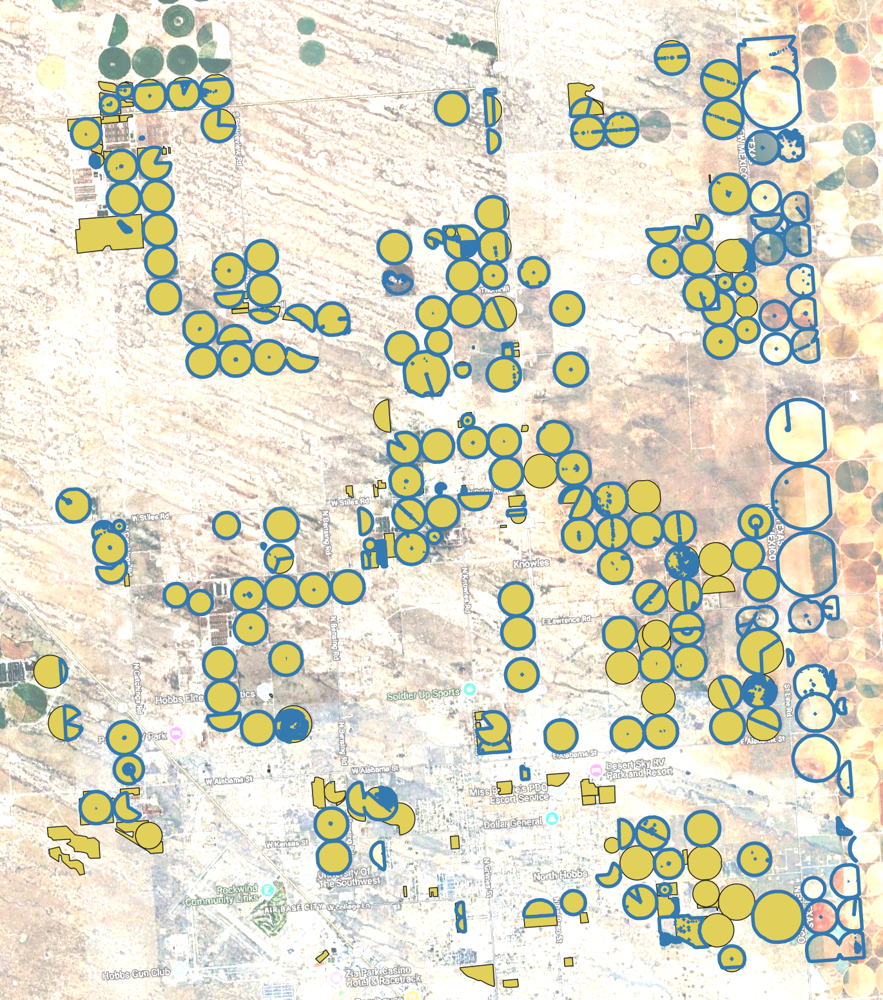

# agribound

**Unified agricultural field boundary delineation toolkit**

[](https://github.com/montimaj/agribound/releases)
[](https://pypi.org/project/agribound/)
[](https://github.com/montimaj/agribound/actions/workflows/ci.yml)
[](https://montimaj.github.io/agribound)
[](https://earthengine.google.com/)
[](LICENSE)
[](https://www.python.org/)
[](https://doi.org/10.5281/zenodo.19229665)
[](https://github.com/montimaj/agribound/stargazers)

---

## Overview

Agribound is a Python package that provides a unified framework for agricultural field boundary delineation by combining seven complementary approaches: object detection, semantic segmentation, vision transformer segmentation, foundation model inference, embedding-based unsupervised clustering, supervised fine-tuning, and multi-engine ensembling. It handles the full pipeline from satellite composite generation through Google Earth Engine (or local GeoTIFFs) to vectorized, post-processed field boundary polygons, supporting Landsat, Sentinel-2, HLS, NAIP, SPOT, and pre-computed embedding datasets (Google Satellite Embeddings, TESSERA) out of the box.

Unlike other field boundary tools that detect *all* visual boundaries (roads, water, forests, buildings), agribound **automatically removes non-agricultural polygons** using LULC data: NLCD for CONUS (1985–2024), Dynamic World globally (2015–present), or C3S Land Cover for pre-2015 coverage, with all zonal statistics computed server-side on GEE. It also supports a fully automated pipeline that combines embedding clusters, Dynamic World crop filtering, and SAM2 boundary refinement on Sentinel-2 to delineate fields anywhere in the world without human-labeled reference data or model training.

The result is a single `agribound.delineate()` call or CLI command that replaces dozens of ad hoc scripts with a reproducible, configurable workflow. Fifteen example scripts and Jupyter notebooks demonstrate workflows spanning six continents, eight satellite sources, and all delineation engines.

## Results

### Supervised: DINOv3 + SAM2 on NAIP (Eastern Lea County, New Mexico, USA)

DINOv3 (SAT-493M satellite-pretrained) fine-tuned on NMOSE reference boundaries, with LULC crop filtering (NLCD) and per-field SAM2 refinement on 1 m NAIP imagery (2020). Blue polygons are model-predicted boundaries; yellow polygons are NMOSE reference boundaries.



### Unsupervised: TESSERA Embeddings + LULC Filter + SAM2 (Pampas, Argentina)

Fully automated pipeline with no reference boundaries or training. TESSERA (128-D) embedding clustering, LULC crop filtering (Dynamic World), and SAM2 boundary refinement on Sentinel-2 (2024).


*Note: The satellite basemap shown in these screenshots may not correspond to the same acquisition date as the imagery used for delineation. See the [docs gallery](https://montimaj.github.io/agribound/gallery/) for results across all regions and engines.*

## Features

- **Multi-satellite support** – Landsat (30 m, 1984–present), Sentinel-2 (10 m), Harmonized Landsat Sentinel (HLS, 30 m), NAIP (1 m), and SPOT 6/7 (6 m)
- **All spectral bands downloaded** – Full multi-band composites are downloaded for each sensor (e.g., all 12 Sentinel-2 spectral bands, all 6 Landsat SR bands). Engines automatically extract and reorder the bands they need via canonical band mappings (e.g., FTW expects R, G, B, NIR as bands 1–4 matching its `B04, B03, B02, B08` training order, so agribound extracts those from the full composite before passing to FTW)
- **Seven delineation engines** – Delineate-Anything, Fields of The World (FTW), GeoAI Field Boundary, DINOv3, Prithvi-EO-2.0, embedding-based unsupervised delineation, and a multi-model ensemble mode
- **SAM2 boundary refinement** – Optional post-processing step that feeds field bounding boxes as prompts to SAM2, producing pixel-accurate masks that replace the original polygons. Best applied to the final ensemble output for efficiency. Can also be used per-engine via `engine_params={"sam_refine": True}`
- **14+ pre-trained FTW models** – All FTW model variants (EfficientNet-B3/B5/B7, CC-BY and standard licensing, v1–v3) are available via `agribound.list_ftw_models()` and selectable through `engine_params`
- **Smart DA routing** – For Sentinel-2, Delineate-Anything automatically delegates to FTW's built-in instance segmentation with proper S2 preprocessing and native MPS (Apple GPU) support. For other sensors, the standalone DA pipeline with sensor-agnostic normalization is used
- **Google Earth Engine integration** – Annual cloud-free composite generation with configurable date ranges, compositing methods (median, greenest pixel, max NDVI), and cloud masking
- **Embedding-based unsupervised delineation** – Google AlphaEarth and TESSERA (Feng et al.) embeddings for CPU-only boundary extraction without any labeled training data
- **Automatic fine-tuning** – Supply reference boundaries and agribound will fine-tune Delineate-Anything (YOLO), GeoAI, DINOv3 (LoRA), or Prithvi on your region before inference. FTW uses pre-trained weights (fine-tuning requires paired temporal windows not yet supported)
- **CLI and Python API** – Full-featured command-line interface (`agribound delineate`) and a clean Python API (`agribound.delineate()`) for scripting and notebooks
- **fiboa-compliant output** – Export to GeoPackage, GeoJSON, or GeoParquet with field area, perimeter, and compactness attributes
- **Dask-based parallelism** – Large study areas are automatically tiled and processed in parallel
- **Automatic LULC crop filtering** – Unlike other field boundary packages that detect *all* visual boundaries (roads, water, forests, buildings), agribound **automatically removes non-agricultural polygons** using the best available land cover dataset for the study area. Uses NLCD (CONUS, 1985–2024), Dynamic World (global, 2015–present), or C3S Land Cover (global, pre-2015). All datasets use nearest-year matching. Enabled by default, configurable threshold, no user intervention required
- **Post-processing pipeline** – Configurable minimum area filtering, Chaikin corner-cutting smoothing, metric-aware polygon simplification, overlap removal, and slivers cleanup
- **Built-in evaluation** – Compare delineated boundaries against reference data with IoU, boundary F1, and over/under-segmentation metrics

## Satellite Sources

All spectral bands are downloaded for each sensor. Engines automatically select the bands they need via canonical R/G/B/NIR mappings.

| Source | Key | Resolution | Bands Downloaded | GEE Collection ID | Notes |
|---|---|---|---|---|---|
| Sentinel-2 | `sentinel2` | 10 m | B1–B12, B8A (12 bands) | `COPERNICUS/S2_SR_HARMONIZED` | Default source; L2A surface reflectance |
| Landsat | `landsat` | 30 m | SR_B2–SR_B7 (6 bands) | `LANDSAT/LC08/C02/T1_L2`, `LANDSAT/LC09/C02/T1_L2` | Long time-series; L5/7 bands harmonized to L8/9 naming |
| HLS | `hls` | 30 m | B1–B7 (7 bands) | `NASA/HLS/HLSL30/v002`, `NASA/HLS/HLSS30/v002` | Harmonized Landsat+Sentinel-2 |
| NAIP | `naip` | 1 m | R, G, B, N (4 bands) | `USDA/NAIP/DOQQ` | 4-band (RGBN); best for small fields. **Very slow over large areas** (100–900x more pixels than S2) |
| SPOT 6/7 | `spot` | 6 m | R, G, B (3 bands) | Restricted – see [SPOT Access](#spot-access) | Restricted GEE collection. **Very slow over large areas**; see note below |
| SPOT 6/7 Panchromatic | `spot-pan` | 1.5 m | P (1 band, triplicated as pseudo-RGB) | Restricted – see [SPOT Access](#spot-access) | Panchromatic band at 1.5 m; triplicated to 3-band pseudo-RGB for engines that expect RGB input. Restricted access |
| Local GeoTIFF | `local` | Any | All bands | N/A | Bring your own imagery via `--local-tif` |
| Google Embeddings | `google-embedding` | 10 m | 64-D embeddings | `GOOGLE/SATELLITE_EMBEDDING/V1/ANNUAL` | Pre-computed satellite embeddings |
| TESSERA Embeddings | `tessera-embedding` | 10 m | 128-D embeddings | N/A | TESSERA foundation model embeddings. Coverage varies by region/year (2017–2025); see [geotessera](https://github.com/ucam-eo/geotessera) |

## Delineation Engines

| Engine | Key | Approach | Strengths | GPU Required | Reference |
|---|---|---|---|---|---|
| Delineate-Anything | `delineate-anything` | YOLO instance segmentation (2 model variants) | Fast; resolution-agnostic (1–10 m+); routes through FTW for S2 with native MPS support | Recommended | [Lavreniuk et al. (2025)](https://arxiv.org/abs/2504.02534) |
| Fields of The World | `ftw` | Semantic segmentation (14+ models: EfficientNet-B3/B5/B7, UNet, UPerNet) | Strong generalization; 25-country training set; all models via `list_ftw_models()` | Yes | [Kerner et al. (2025)](https://fieldsofthe.world/) |
| GeoAI Field Boundary | `geoai` | Mask R-CNN instance segmentation | Built-in NDVI support; auto-falls back to CPU on Apple Silicon. **Without fine-tuning on region-specific reference data, GeoAI typically does not delineate any fields** | No | [Wu (2026)](https://github.com/opengeos/geoai) |
| DINOv3 | `dinov3` | DINOv3 ViT backbone (SAT-493M satellite-pretrained) + DPT segmentation head | Satellite-native ViT features pretrained on 493M satellite images; LoRA fine-tuning; resolution-agnostic | Yes | [Siméoni et al. (2025)](https://arxiv.org/abs/2508.10104) |
| Prithvi-EO-2.0 | `prithvi` | NASA/IBM ViT foundation model (embed / PCA / segment modes) | 1024-D ViT embeddings from 6 HLS bands; PCA baseline for comparison. **ViT embed mode requires fine-tuning for good results** | Recommended (embed); No (PCA) | [Szwarcman et al. (2024)](https://arxiv.org/abs/2412.02732) |
| Embedding | `embedding` | Unsupervised clustering of pre-computed embeddings | No GPU needed; no labeled data required | No | [Brown et al. (2025)](https://arxiv.org/abs/2507.22291), [Feng et al. (2025)](https://arxiv.org/abs/2506.20380) |
| Ensemble | `ensemble` | Multi-engine or multi-model consensus (vote / union / intersection) | Best accuracy; supports running same engine with different models | Depends on engines | –|

## Installation

We recommend creating a conda environment first to handle geospatial binary dependencies (GDAL, PROJ, rasterio) that are difficult to install via pip alone:

```bash
conda create -n agribound python=3.12 gdal rasterio geopandas fiona shapely pyproj -c conda-forge
conda activate agribound
pip install agribound
```

> **Note:** The `gdal` conda package provides the GDAL Python bindings (`osgeo`) required by `geedim` for downloading satellite composites from Google Earth Engine. Installing `libgdal` alone is not sufficient –you need the full `gdal` package.

Alternatively, install directly via pip if you have system GDAL with Python bindings already available:

```bash
pip install agribound
```

Install with optional extras depending on which engines and features you need:

```bash
# Google Earth Engine support (requires gdal Python bindings)
pip install "agribound[gee]"

# Individual engines
pip install "agribound[delineate-anything]"
pip install "agribound[ftw]"
pip install "agribound[geoai]"
pip install "agribound[prithvi]"
pip install "agribound[samgeo]"
pip install "agribound[tessera]"

# Everything
pip install "agribound[all]"
```

> **Note:** The `[ftw]` extra installs `ftw-tools` v1.x from PyPI, which supports FTW semantic segmentation. To use **Delineate-Anything on Sentinel-2** (instance segmentation via FTW), you must also install the development version of ftw-baselines:
>
> ```bash
> git clone https://github.com/fieldsoftheworld/ftw-baselines.git
> pip install -e ftw-baselines
> ```
>
> This provides the `ftw_tools` module with `run_instance_segmentation`. Without it, DA on Sentinel-2 will fall back to an error. DA on all other sensors (Landsat, NAIP, HLS, SPOT, local) works without this step. Once `ftw-tools` v2.0+ is released on PyPI, this extra install step will no longer be needed.

For development:

```bash
git clone https://github.com/montimaj/agribound.git
cd agribound
pip install -e ".[all,dev,docs]"

# Required for DA instance segmentation on Sentinel-2
git clone https://github.com/fieldsoftheworld/ftw-baselines.git ../ftw-baselines
pip install -e ../ftw-baselines
```

## Quick Start (Python)

```python
import agribound

gdf = agribound.delineate(
    study_area="my_region.geojson",
    source="sentinel2",
    year=2024,
    engine="delineate-anything",
    gee_project="my-gee-project",
)
gdf.to_file("fields.gpkg")
```

## Quick Start (CLI)

```bash
agribound delineate \
    --study-area my_region.geojson \
    --source sentinel2 \
    --year 2024 \
    --engine delineate-anything \
    --gee-project my-gee-project \
    --output fields.gpkg
```

## Configuration

Instead of passing all options on the command line, you can use a YAML configuration file:

```yaml
# config.yml
study_area: my_region.geojson
source: sentinel2
year: 2024
engine: delineate-anything

# GEE settings
gee_project: my-gee-project
export_method: local            # local | gdrive | gcs
cloud_cover_max: 20
composite_method: median        # median | greenest | max_ndvi

# Post-processing
min_field_area_m2: 2500         # minimum field area in m²
simplify_tolerance: 2.0         # simplification tolerance in meters
lulc_filter: true               # remove non-agricultural polygons (default: true)
lulc_crop_threshold: 0.3        # crop fraction threshold (default: 0.3)
lulc_batch_size: 200            # polygons per GEE batch (default: 200)

# Engine-specific parameters
engine_params:
  confidence: 0.4
  iou_threshold: 0.5

# Output
output_path: fields.gpkg
output_format: gpkg             # gpkg | geojson | parquet

device: auto                    # auto | cuda | cpu | mps
n_workers: 4
```

Run with:

```bash
agribound delineate --config config.yml
```

## Project Structure

```
agribound/
├── agribound/                  # Main package
│   ├── __init__.py             # Public API (delineate, evaluate, show_boundaries)
│   ├── _version.py             # Version string
│   ├── auth.py                 # GEE authentication helpers
│   ├── cli.py                  # Click-based CLI (agribound delineate, auth, ...)
│   ├── config.py               # AgriboundConfig dataclass
│   ├── evaluate.py             # IoU / F1 / precision / recall metrics
│   ├── pipeline.py             # Main delineate() orchestrator
│   ├── visualize.py            # Interactive map generation (folium/leafmap)
│   ├── composites/             # Satellite composite builders
│   │   ├── base.py             # Source registry and abstract builder
│   │   ├── gee.py              # GEE composites (Landsat, S2, HLS, NAIP, SPOT)
│   │   ├── local.py            # Local GeoTIFF and embedding loaders
│   │   └── dynamic_world.py    # Dynamic World crop probability downloads
│   ├── engines/                # Delineation engines
│   │   ├── base.py             # Engine registry and abstract base class
│   │   ├── delineate_anything.py  # YOLO instance segmentation
│   │   ├── ftw.py              # Fields of The World semantic segmentation
│   │   ├── geoai_field.py      # GeoAI Mask R-CNN
│   │   ├── dinov3.py           # DINOv3 ViT + DPT semantic segmentation
│   │   ├── prithvi.py          # Prithvi-EO-2.0 foundation model
│   │   ├── embedding.py        # Unsupervised K-means on embeddings
│   │   ├── ensemble.py         # Multi-engine vote / union / intersection
│   │   ├── samgeo_engine.py    # SAM2 boundary refinement (box-prompted)
│   │   └── finetune.py         # Reference-boundary fine-tuning
│   ├── io/                     # I/O utilities
│   │   ├── crs.py              # CRS helpers (UTM lookup, equal-area)
│   │   ├── raster.py           # GeoTIFF reading, tiling, band selection
│   │   └── vector.py           # Study area / reference boundary readers
│   └── postprocess/            # Post-processing pipeline
│       ├── filter.py           # Area filtering
│       ├── lulc_filter.py      # LULC-based crop filtering (NLCD / Dynamic World / C3S)
│       ├── merge.py            # Cross-tile polygon merging (IoU-based)
│       ├── polygonize.py       # Raster mask → vector polygons
│       ├── regularize.py       # Polygon regularization
│       └── simplify.py         # Douglas-Peucker simplification
├── assets/                     # Gallery screenshots and example images
├── examples/                   # Example scripts (15) and Jupyter notebooks
│   ├── 01–15_*.py              # Runnable Python scripts
│   └── notebooks/              # Interactive notebook versions
├── tests/                      # Pytest suite
│   ├── conftest.py             # Shared fixtures and test data
│   ├── data/                   # Test data (GeoTIFFs, GeoJSONs)
│   ├── unit/                   # Unit tests (config, evaluate, I/O, postprocess, LULC)
│   └── integration/            # Integration tests (CLI, local pipeline)
├── paper/                      # JOSS paper (not included in PyPI distribution)
│   ├── paper.md                # Manuscript source
│   └── paper.bib               # References
├── docs/                       # MkDocs documentation source
│   ├── api/                    # API reference (auto-generated from docstrings)
│   ├── gallery.md              # Visual results across regions and engines
│   └── user-guide/             # Quickstart, engines, satellite sources, etc.
├── CITATION.cff                # Citation metadata (JOSS / Zenodo)
├── CONTRIBUTING.md             # Developer guide
├── DISCLAIMER.md               # AI usage and funding disclosure
├── LICENSE                     # Apache 2.0
├── MANIFEST.in                 # Source distribution inclusions/exclusions
├── mkdocs.yml                  # MkDocs site configuration
├── pyproject.toml              # Build config, dependencies, optional extras
└── README.md
```

## Examples

Example scripts and interactive Jupyter notebooks are provided in the [`examples/`](examples/) directory. See the [examples README](examples/README.md) for full details.

| Script | Notebook | Description |
|---|---|---|
| [01_new_mexico_landsat_timeseries.py](examples/01_new_mexico_landsat_timeseries.py) | [notebook](examples/notebooks/01_new_mexico_landsat_timeseries.ipynb) | 40-year annual field boundaries using Landsat 5-9 time-series over New Mexico |
| [02_india_ganges_sentinel2.py](examples/02_india_ganges_sentinel2.py) | [notebook](examples/notebooks/02_india_ganges_sentinel2.ipynb) | Smallholder rice field delineation in Nadia District (West Bengal), India |
| [03_australia_murray_darling_hls.py](examples/03_australia_murray_darling_hls.py) | [notebook](examples/notebooks/03_australia_murray_darling_hls.ipynb) | Prithvi ViT embeddings vs PCA baseline on irrigated agriculture in Murray-Darling Basin (HLS) |
| [04_france_beauce_sentinel2.py](examples/04_france_beauce_sentinel2.py) | [notebook](examples/notebooks/04_france_beauce_sentinel2.ipynb) | Large-field European agriculture in the Beauce region, France |
| [05_pampas_embeddings.py](examples/05_pampas_embeddings.py) | [notebook](examples/notebooks/05_pampas_embeddings.ipynb) | CPU-only unsupervised delineation in the Argentine Pampas using Google/TESSERA embeddings |
| [06_kenya_smallholder_ftw.py](examples/06_kenya_smallholder_ftw.py) | [notebook](examples/notebooks/06_kenya_smallholder_ftw.ipynb) | East Africa smallholder fields with the Fields of The World engine |
| [07_usa_naip_high_res.py](examples/07_usa_naip_high_res.py) | [notebook](examples/notebooks/07_usa_naip_high_res.ipynb) | High-resolution (1 m) boundary extraction from NAIP imagery |
| [08_china_north_plain_spot.py](examples/08_china_north_plain_spot.py) | [notebook](examples/notebooks/08_china_north_plain_spot.ipynb) | Field mapping from SPOT 6/7 imagery over the North China Plain |
| [09_ensemble_comparison.py](examples/09_ensemble_comparison.py) | [notebook](examples/notebooks/09_ensemble_comparison.ipynb) | Multi-engine comparison and ensemble fusion |
| [10_local_tif_quickstart.py](examples/10_local_tif_quickstart.py) | [notebook](examples/notebooks/10_local_tif_quickstart.ipynb) | Five-line quickstart using a local GeoTIFF with no GEE dependency |
| [11_mississippi_alluvial_plain_spot.py](examples/11_mississippi_alluvial_plain_spot.py) | [notebook](examples/notebooks/11_mississippi_alluvial_plain_spot.ipynb) | SPOT 6/7 field delineation in the Mississippi Alluvial Plain with cross-year stability analysis |
| [12_new_mexico_ensemble_timeseries.py](examples/12_new_mexico_ensemble_timeseries.py) | [notebook](examples/notebooks/12_new_mexico_ensemble_timeseries.ipynb) | Multi-model per-source ensemble (2024) over Eastern Lea County, NM. Vote-merges engines within each sensor, not across resolutions |
| [13_sam2_refine_dinov3.py](examples/13_sam2_refine_dinov3.py) | [notebook](examples/notebooks/13_sam2_refine_dinov3.ipynb) | Standalone SAM2 boundary refinement on pre-computed DINOv3 field boundaries |
| [14_dinov3_sam2_ensemble.py](examples/14_dinov3_sam2_ensemble.py) | [notebook](examples/notebooks/14_dinov3_sam2_ensemble.ipynb) | DINOv3 + SAM2 multi-source comparison across 5 sensors (Eastern Lea County, New Mexico, USA) |
| [15_pampas_semi_supervised.py](examples/15_pampas_semi_supervised.py) | [notebook](examples/notebooks/15_pampas_semi_supervised.ipynb) | Automated pipeline: Google + TESSERA embeddings → LULC filter → SAM2 on S2. 6-way comparison, no training needed |

## Google Earth Engine Authentication

This section is only required when using GEE-based satellite sources (Landsat, Sentinel-2, HLS, NAIP, SPOT) or embedding datasets. **If you are working with local GeoTIFFs (`source="local"`), GEE authentication is not needed** and you can skip this section entirely.

**Setup steps:**

1. Install the [Google Cloud CLI](https://cloud.google.com/sdk/docs/install)
2. Create a Google Cloud project (e.g., `my-gee-project`) with the Earth Engine API enabled at [https://console.cloud.google.com/](https://console.cloud.google.com/)
3. Configure and authenticate:

```bash
gcloud config set project my-gee-project
gcloud auth application-default set-quota-project my-gee-project  # if prompted
earthengine authenticate
```

4. Use the agribound auth helper to verify:

```bash
agribound auth --project YOUR_GEE_PROJECT
```

This wraps `ee.Authenticate()` and `ee.Initialize()` with clear error messages. The `--project` flag is optional if you already ran `gcloud config set project` in step 3 — agribound will auto-detect it.

**For non-interactive environments (CI, HPC):** use a service account key:

```bash
export GOOGLE_APPLICATION_CREDENTIALS=/path/to/service-account-key.json
agribound auth --project YOUR_GEE_PROJECT --service-account-key /path/to/service-account-key.json
```

See the [Earth Engine Python installation guide](https://developers.google.com/earth-engine/guides/python_install) for more details.

## SPOT Access

The SPOT 6/7 collection in Google Earth Engine is **restricted** and is not publicly available. Access is limited to select GEE users under a data-sharing agreement. This source is primarily intended for internal use at the Desert Research Institute (DRI).

If you are interested in having SPOT-based field boundaries processed for your study area, please contact the author at <sayantan.majumdar@dri.edu> to discuss data access and processing arrangements.

## Apple Silicon (MPS) Note

The **GeoAI engine** (Mask R-CNN) is unstable on Apple Silicon GPUs via MPS (Metal Performance Shaders). Metal command buffer errors cause crashes during both training and inference. Agribound automatically detects MPS and falls back to CPU for GeoAI operations. All other engines (FTW, Delineate-Anything, Prithvi) work correctly on MPS.

## Citation

If you use agribound in your research, please cite:

> Majumdar, S., Huntington, J. L., ReVelle, P., Nozari, S., Smith, R. G., Hasan, M. F., Bromley, M., Atkin, J., Jensen, E. R., Ketchum, D., & Roy, S. (2026). *Agribound: Unified agricultural field boundary delineation combining satellite foundation models, embeddings, and global training data* [Software]. _Zenodo_. https://doi.org/10.5281/zenodo.19229666

> Majumdar, S., Huntington, J. L., ReVelle, P., Nozari, S., Smith, R. G., Hasan, M. F., Bromley, M., Atkin, J., Jensen, E. R., Ketchum, D., & Roy, S. (2026). *Agribound: Unified agricultural field boundary delineation combining satellite foundation models, embeddings, and global training data*. In prep. for _Journal of Open Source Software_.


Please also cite the underlying engines and models as appropriate:

- **Delineate-Anything**: Lavreniuk, M., Kussul, N., Shelestov, A., Yailymov, B., Salii, Y., Kuzin, V., & Szantoi, Z. (2025). Delineate Anything: Resolution-agnostic field boundary delineation on satellite imagery. *arXiv preprint arXiv:2504.02534*. https://arxiv.org/abs/2504.02534
- **Fields of The World (FTW)**: Kerner, H., Chaudhari, S., Ghosh, A., Robinson, C., Ahmad, A., Choi, E., Jacobs, N., Holmes, C., Mohr, M., Dodhia, R., Lavista Ferres, J. M., & Marcus, J. (2025). Fields of The World: A machine learning benchmark dataset for global agricultural field boundary segmentation. *Proceedings of the AAAI Conference on Artificial Intelligence*, 39(27), 28151–28159. https://doi.org/10.1609/aaai.v39i27.35034
- **GeoAI**: Wu, Q. (2026). GeoAI: A Python package for integrating artificial intelligence with geospatial data analysis and visualization. *Journal of Open Source Software*, 11(118), 9605. https://doi.org/10.21105/joss.09605
- **DINOv3**: Siméoni, O., Vo, H. V., Seitzer, M., Baldassarre, F., Oquab, M., Jose, C., Khalidov, V., Szafraniec, M., Yi, S., Ramamonjisoa, M., Massa, F., Haziza, D., Wehrstedt, L., Wang, J., Darcet, T., Moutakanni, T., Sentana, L., Roberts, C., Vedaldi, A., ... Bojanowski, P. (2025). DINOv3. *arXiv preprint arXiv:2508.10104*. https://arxiv.org/abs/2508.10104
- **Prithvi-EO-2.0**: Szwarcman, D., Roy, S., Fraccaro, P., et al. (2024). Prithvi-EO-2.0: A versatile multi-temporal foundation model for Earth observation applications. *arXiv preprint arXiv:2412.02732*. https://arxiv.org/abs/2412.02732
- **TESSERA**: Feng, Z., Atzberger, C., Jaffer, S., Knezevic, J., Sormunen, S., Young, R., Lisaius, M. C., Immitzer, M., Jackson, T., Ball, J., Coomes, D. A., Madhavapeddy, A., Blake, A., & Keshav, S. (2025). TESSERA: Temporal embeddings of surface spectra for Earth representation and analysis. *arXiv preprint arXiv:2506.20380*. https://arxiv.org/abs/2506.20380
- **SamGeo**: Wu, Q., & Osco, L. (2023). samgeo: A Python package for segmenting geospatial data with the Segment Anything Model (SAM). *Journal of Open Source Software*, 8(89), 5663. https://doi.org/10.21105/joss.05663
- **SAM for Remote Sensing**: Osco, L. P., Wu, Q., de Lemos, E. L., Gonçalves, W. N., Ramos, A. P. M., Li, J., & Junior, J. M. (2023). The Segment Anything Model (SAM) for remote sensing applications: From zero to one shot. *International Journal of Applied Earth Observation and Geoinformation*, 124, 103540. https://doi.org/10.1016/j.jag.2023.103540
- **SAM 2**: Ravi, N., Gabeur, V., Hu, Y.-T., Hu, R., Ryali, C., Ma, T., Khedr, H., Rädle, R., Rolland, C., Gustafson, L., Mintun, E., Pan, J., Alwala, K. V., Carion, N., Wu, C.-Y., Girshick, R., Dollár, P., & Feichtenhofer, C. (2024). SAM 2: Segment anything in images and videos. *arXiv preprint arXiv:2408.00714*. https://arxiv.org/abs/2408.00714
- **geemap**: Wu, Q. (2020). geemap: A Python package for interactive mapping with Google Earth Engine. *Journal of Open Source Software*, 5(51), 2305. https://doi.org/10.21105/joss.02305
- **Google Satellite Embeddings (AlphaEarth)**: Brown, C. F., Kazmierski, M. R., Pasquarella, V. J., Rucklidge, W. J., Samsikova, M., Zhang, C., Shelhamer, E., Lahera, E., Wiles, O., Ilyushchenko, S., Gorelick, N., Zhang, L. L., Alj, S., Schechter, E., Askay, S., Guinan, O., Moore, R., Boukouvalas, A., & Kohli, P. (2025). AlphaEarth Foundations: An embedding field model for accurate and efficient global mapping from sparse label data. *arXiv preprint arXiv:2507.22291*. https://doi.org/10.48550/arXiv.2507.22291
- **Google Earth Engine**: Gorelick, N., Hancher, M., Dixon, M., Ilyushchenko, S., Thau, D., & Moore, R. (2017). Google Earth Engine: Planetary-scale geospatial analysis for everyone. *Remote Sensing of Environment*, 202, 18–27. https://doi.org/10.1016/j.rse.2017.06.031
- **Awesome GEE Community Catalog**: Roy, S., Majumdar, S., & Swetnam, T. (2025). samapriya/awesome-gee-community-datasets: Community Catalog (3.9.0). Zenodo. https://doi.org/10.5281/zenodo.17641528

## License

This project is licensed under the [Apache License 2.0](LICENSE).

## Acknowledgments

Agribound builds on the work of many open-source projects and research teams:

- The **Ultralytics** team for YOLOv8/v11 and the broader YOLO ecosystem
- **Meta AI Research** for the Segment Anything Model (SAM)
- The **Fields of The World** consortium and Hannah Kerner's group at Arizona State University
- **Qiusheng Wu** for the GeoAI Python package and field boundary segmentation model
- **NASA** and **IBM Research** for the Prithvi geospatial foundation model and TerraTorch
- **Google Research** for AlphaEarth satellite embeddings
- **Feng et al.** for the TESSERA foundation model embeddings
- The **Google Earth Engine** team for planetary-scale geospatial computing
- The **fiboa** community for the field boundary schema standard
- The **TorchGeo** team for geospatial deep learning data loaders and utilities
- The **Desert Research Institute (DRI)** for supporting this research

## Funding

This work was supported by multiple funding sources. The **New Mexico Office of the State Engineer (NMOSE)** provided reference field boundary data and supported the development of agricultural water use mapping in New Mexico. The **Google Satellite Embeddings Dataset Small Grants Program** enabled the integration of pre-computed satellite embeddings for unsupervised field boundary delineation. Access to the **SPOT 6 and 7 archive on Google Earth Engine** was provided through the Google Trusted Tester opportunity. Additional support was provided by the **U.S. Army Corps of Engineers** and **The U.S. Department of Treasury/State of Nevada**. This work was also supported by the **United States Geological Survey (USGS)** and **NASA Landsat Science Team**, the **USGS Water Resources Research Institute**, the **Desert Research Institute Maki Endowment**, and the **Windward Fund**.


## AI Usage Disclosure

Portions of this software were developed with the assistance of AI coding tools, including Anthropic's Claude. AI was used to accelerate code scaffolding, documentation drafting, and test generation. All AI-generated code was reviewed, tested, and validated by the human authors. The scientific methodology, architectural decisions, algorithm selection, and domain-specific implementations reflect the expertise and judgment of the authors.