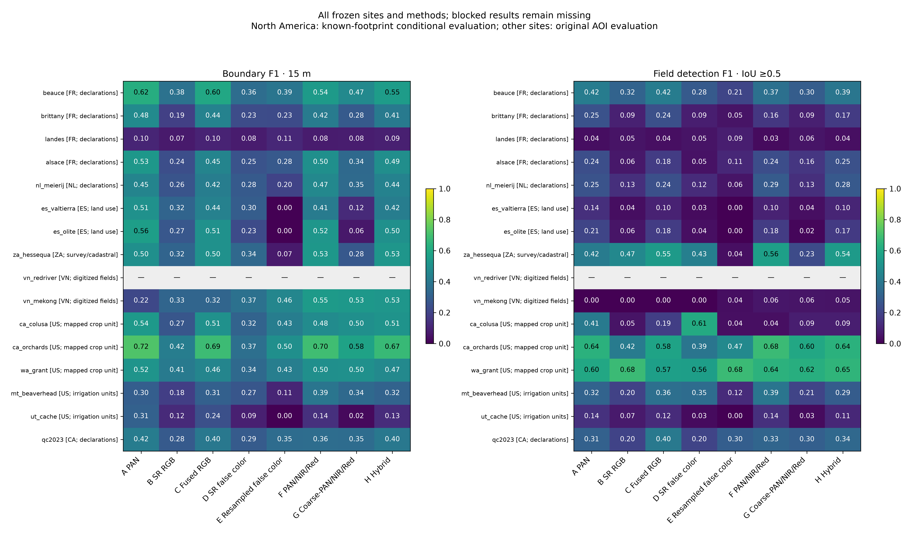

# Landsat NIR, channel stacking and hybrid comparison

Example 27 extends the completed PAN/SR suites with five new inputs at every
feasible existing location. Its versioned configuration retains **16 sites in
seven countries**, including the previously blocked Red River site. Eight
representative locations in six countries were selected from geography,
reference crop attributes and regional climate evidence before new inference.
No site or acquisition window is replaced after observing scores.

The runnable files are `examples/27_landsat_multispectral_comparison.py` and
`examples/landsat_multispectral_sites.json`. The figures and measured report
are regenerated by the two adjacent `landsat_multispectral_*` helper scripts.

## Install and execute

Use Python >=3.12 from the repository root. The existing constraint file
records the tested Windows/Python environment; other platforms may need
different wheel versions.

```bash
python -m pip install -c examples/landsat_comparison_constraints.txt -e ".[gee,delineate-anything]" matplotlib
agribound auth --project ee-rappjer
python examples/27_landsat_multispectral_comparison.py --gee-project ee-rappjer
```

Earth Engine access requires an enabled account, authenticated credentials,
and permission to use the registered project. Public reference downloads do
not require accounts. Imagery, references and the released model are reused
from the completed suites. On a fresh workspace, the runner can prepare
missing prior references/configurations using examples 23, 25 and 26:

```bash
python examples/27_landsat_multispectral_comparison.py --bootstrap-existing --prepare-only
python examples/27_landsat_multispectral_comparison.py --bootstrap-existing
```

Previously completed source folders are preserved. Missing imagery for a
previously blocked site is attempted in the new suite's `acquisition` folder.
An online run downloads the pinned model when neither cached weights nor
`--checkpoint` are available. An offline inference run requires existing
weights; preparation, evaluation and figure regeneration do not load them.

The executed offline comparison uses the existing checkpoint:

```powershell
Remove-Item Env:PROJ_LIB,Env:PROJ_DATA,Env:GDAL_DATA -ErrorAction SilentlyContinue
.venv\Scripts\python.exe examples/27_landsat_multispectral_comparison.py --offline --skip-figures
```

Clear those variables only if another GIS installation has supplied
incompatible data paths. The geospatial wheels then use their own data.

Checkpoint revision: `369d0b4c44cf9bec2bd3a27bc81810cadd2c963e`.
SHA-256: `46700b8a279b07922953a11adaeb5e658d9a2384b6334c8e0a3090886218915a`.
The runner rejects a different model and saves `model_pin.json`.

```bash
# Prepare all reference-selected windows and new inputs, without inference:
python examples/27_landsat_multispectral_comparison.py --offline --prepare-only
# Run or resume a subset; unchanged completed results are reused:
python examples/27_landsat_multispectral_comparison.py --offline --sites beauce ut_cache --methods false_color pan_nir_red hybrid --skip-figures
# Rescore existing vectors; do not repeat inference:
python examples/27_landsat_multispectral_comparison.py --offline --evaluate-only --skip-figures
# Rebuild tables, figures and report without inference or model loading:
python examples/27_landsat_multispectral_comparison.py --summarize-only
# Retry the unchanged Red River selection online:
python examples/27_landsat_multispectral_comparison.py --sites vn_redriver --prepare-only --skip-figures
```

`--checkpoint PATH`, `--output-dir PATH`, `--methods` and `--sites` support
explicit runs. A changed frozen configuration, source checksum or inference
signature requires another output directory. `--figures-only --offline`
verifies existing outputs and regenerates maps. Normal runs continue other
sites after blockers and exit nonzero when requested methods are unmeasured.
Existing prepared inputs also require their recorded checksums: the runner
rejects orphaned rasters if `input_provenance.json` is missing or incomplete.
Preserve that file when moving cached inputs; use another output directory
after an interrupted preparation that did not finish writing provenance.

## Inputs and controls

| ID | Logical model channels, in order | Grid |
| --- | --- | --- |
| A | PAN, PAN, PAN | 15 m |
| B | SR Red, Green, Blue | 30 m |
| C | Existing fused Red, Green, Blue | 15 m |
| D | SR NIR, Red, Green | 30 m |
| E | Nearest-neighbour resampled NIR, Red, Green | 15 m |
| F | PAN, resampled NIR, resampled Red | 15 m |
| G | PAN averaged to 30 m then resampled, resampled NIR, resampled Red | 15 m |
| H | Resampled NIR, existing fused Red, existing fused Green | 15 m |

PAN B8 remains unit TOA reflectance. B5/B4/B3 are surface reflectance; prepared
new SR channels are divided by 10,000 to unit reflectance. The historical
SR baseline uses `reflectance_x10000`; the engine's independent per-channel
stretch accounts for this scale difference. F/G are **channel stacking**.
H reuses visible fusion and leaves NIR unchanged. Its visible values remain
experimental, rather than calibrated 15 m SR.

[USGS's spectral specifications](https://www.usgs.gov/faqs/what-are-band-designations-landsat-satellites)
give PAN approximately 0.50–0.68 μm and NIR B5 0.85–0.88 μm. Their nonoverlap
is why this experiment does not inject visible PAN residuals into NIR.
Nearest-neighbour replication adds no native SR detail.

The [author's paper](https://arxiv.org/html/2607.19069v1) describes training on
512×512 RGB patches. D–H are input-distribution experiments with the same
RGB-trained weights. They do not establish an optimized multispectral model.
At 15/30 m, a 512-pixel tile spans 7.68/15.36 km. Resampling control E changes
both the grid and physical context; it does not isolate them completely.
The engine reads reversed BGR indices for NumPy input, and Ultralytics
reverses them to the requested logical RGB-slot order. An offline test uses
the real preprocessing function to verify this path.

All methods share matched Landsat 8/9 scenes, QA, temporal median, common
six-band SR/four-subpixel PAN support, reference geometry and inclusion rules.
Settings remain FP32, seed 42, confidence 0.15, batch 1, tile step 0.5,
super-resolution 1, 1000 m² minimum area, 2 m simplification, and no LULC/SAM.
Existing baseline vectors are reused only after provenance and support checks.
The suite recalculates evaluation in its own output folder, preserving originals.

## Measurements and artifacts

Outputs are under `outputs/landsat_multispectral/`:

- `comparison.csv`, `headline_15m.csv`, `per_site_headline_wide.csv` and
  `aggregate_metrics.csv`: site/size/tolerance/scope metrics and descriptive means.
- `paired_differences.csv` and `paired_difference_summary.csv`: planned contrasts,
  sign counts, equal-site/field-weighted means and descriptive paired-site bootstrap.
- `reference_inventory.csv`, per-site inventory JSON, scene manifests, fusion
  validation, common-support integrity checks and GeoPackage provenance.
- Per-site raw GeoPackages for A–H and coverage-selected GeoPackages where
  required, with metrics at 10/15/30 m and per-field CSVs.
- Two per-site map pages covering all methods plus a reference-only column;
  enlarged small-field/shared-edge rows and separate input-explanation figures.
- `representative_landscapes`, `all_site_performance`, `paired_contrasts`,
  `field_size_performance` and `runtime_accuracy` in PNG/PDF/SVG, with source data.
- `REPORT.md`, frozen configuration, status table and checksummed artifact manifest.

Boundary and one-to-one IoU>=0.5 detection metrics use the existing evaluator.
North American primary scores remain conditional on mapped footprints; raw
AOI scores are retained separately. Whole polygons are matched and boundary
metrics use original lines inside coverage, without synthetic clipping edges.
Results distinguish physical digitization, crop units, declarations and
irrigation units. Unknown mapped coverage is not confirmed non-agricultural land.

Maps use one muted, unsharpened SR RGB background per site, identical extents,
cyan dashed references and orange predictions. All zoom windows are selected
from reference geometry. The representative plate uses a common 900 m scale
and metadata-based site selection. Crop labels denote site/provider context;
Vietnamese rice descriptions are regional, not field species measurements.

Runtime CSVs include host/software provenance and baseline-reuse flags. Shared
preparation time covers all five new inputs; it is not per-method acquisition
time. Delineation time includes model loading. Single-run timing and site
bootstrap variability should not be interpreted as population or causal evidence.

All geometry and maps stay in ignored local outputs. In particular, the
representative plate includes restricted South African reference geometry;
its redistribution requires resolving provider terms. Washington and Montana
reference-overlay maps also remain local. Source-specific terms, vintage
mismatches and numerical positional-accuracy gaps are retained in the inventory.

## Measured execution

On October 2, 2026, **75 new delineations completed at 15 sites**, alongside
45 reused baselines, against 4,099 reference polygons. All 45 rescored baseline
comparisons match the original metrics, and their vectors remain unchanged.
The authenticated Red River retry again found no scenes under its fixed
selection; all eight methods there remain unmeasured.

Equal-site headline means are:

| Method | Boundary F1, 15 m | Detection F1, IoU >=0.5 |
| --- | --- | --- |
| A PAN | 0.452 | 0.292 |
| B SR RGB | 0.271 | 0.189 |
| C Existing fused RGB | 0.426 | 0.278 |
| D SR false color | 0.274 | 0.216 |
| E Resampled false color | 0.237 | 0.147 |
| F PAN/NIR/Red stack | 0.438 | 0.280 |
| G Coarse-PAN stack | 0.320 | 0.195 |
| H Hybrid | 0.431 | 0.275 |



Native PAN detail improves F versus G by 0.118 boundary F1 and 0.085 detection
F1 on average, with improvements at 12/15 and 13/15 sites respectively.
The new combinations still fall below PAN alone in the equal-site means.
False-color SR improves detection at only three sites: its equal-site change
is +0.027, while reference-count weighting changes the result to -0.011.
These differences support site-specific validation rather than a universal
input recommendation for this RGB-trained checkpoint.

In Colusa, false-color SR increases detection to 0.611 versus PAN's 0.410,
while boundary F1 falls to 0.320 versus 0.542. In the Mekong digitized reference,
stacking raises boundary F1 to 0.546 versus 0.218, but detection remains 0.061.
Montana stacking improves both measures over PAN, against irrigation mapping
units. These are descriptive site findings with different reference types.

Measured CSVs, the report and quantitative figures are also stored in
`assets/landsat_pan_comparison/multispectral/`. Full-resolution maps and
GeoPackages remain in `outputs/landsat_multispectral/`; restricted reference
overlays are not copied to documentation assets. Representative detail views
use 900 m windows; a companion overview plate uses the same frozen AOIs and
explicit scale bars for different row scales. The blocked site has a clearly
marked reference-only preview with a plain background.
`representative_controls` provides a reference-only view beside fused RGB (C),
resampled false color (E), and coarse-PAN stacking (G), using the same eight
sites and frozen 900 m windows. Its PDF, 300 dpi PNG, SVG, and source JSON
remain local under the same redistribution restrictions as the main plate.

The relevant regression run passed **659 offline tests**, and the strict
documentation build passed. Exact verification logs are in the output folder;
`verification.json` and `baseline_preservation_validation.csv` retain the checks.

## Offline checks

```bash
python -m pytest tests/unit/test_landsat_multispectral.py tests/unit/test_landsat_multispectral_runner.py tests/unit/test_landsat_multispectral_figures.py tests/unit/test_pan_fusion.py tests/unit/test_boundary_coverage.py tests/unit/test_landsat_comparison.py tests/unit/test_landsat_international.py tests/unit/test_landsat_north_america.py -q
```

These check channel identities, actual RGB/BGR preprocessing, no NIR sharpening,
unchanged visible fusion, exact PAN degradation controls, missing subpixel
support, CRS/grid mismatch, whole-polygon coverage selection, empty predictions,
rejection of orphaned or modified cached inputs, and exclusion of stale failed
predictions from maps. The controls-plate test verifies that it covers the
remaining frozen methods without changing representative-site selection.
