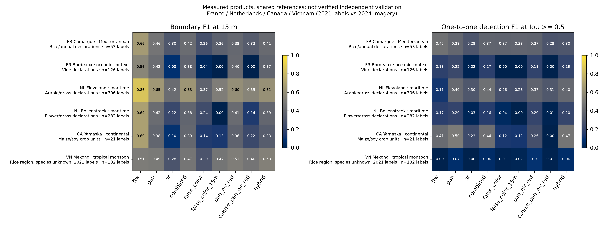
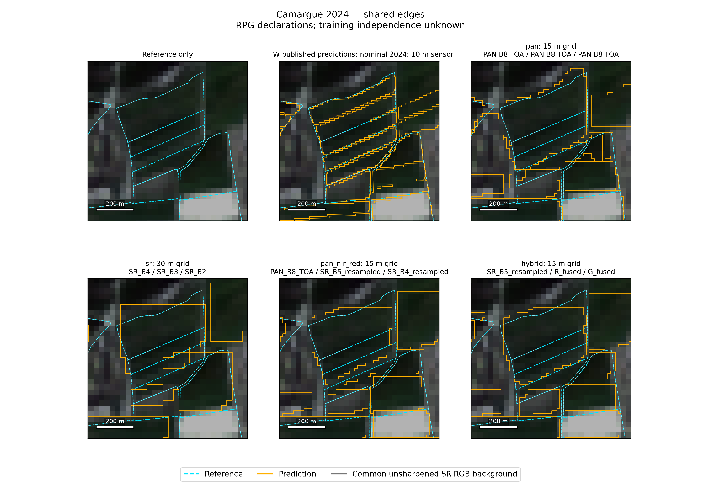

# Landsat PAN and published FTW tutorials

Examples 29 and 30 are short offline tutorials built on the existing comparison
helpers. Their synchronized notebooks run from the repository root or
`examples/notebooks/`. They use a licensed 3.4 MB snapshot of real Camargue 2024
inputs and measured predictions. Offline execution prepares controls, validates
fusion, reevaluates cached polygons and makes figures; it does not rerun inference.

## Install and run offline

Use Python 3.12 or 3.13 and a source checkout containing `examples/data/landsat_tutorial`.
The bundle is repository teaching data; it is not part of the installed wheel.
Published FTW querying needs the core package, not the FTW inference extra.

```bash
python -m venv .venv
# Linux/macOS: source .venv/bin/activate
# Windows PowerShell: .\.venv\Scripts\Activate.ps1
python -m pip install -e . matplotlib nbformat nbclient ipykernel jupyterlab
python examples/29_landsat_pan_field_delineation.py
python examples/30_landsat_ftw_product_comparison.py
python -m jupyterlab
```

Open either `29_landsat_pan_field_delineation.ipynb` or
`30_landsat_ftw_product_comparison.ipynb` under `examples/notebooks/`; run all cells.
`NOTEBOOK_ARGS = []` selects offline mode and ignores kernel connection arguments.
All output goes to `outputs/landsat_tutorial/{pan,ftw}/`. Notebook outputs and
execution counts are cleared in the repository. Mirrored research notebooks
23–28 remain CLI-oriented runners; these two tutorials are the approachable entry points.

On Windows, use a wheel-based virtual environment and remove inherited GIS
paths from another installation if rasterio/pyproj cannot locate their databases:

```powershell
Remove-Item Env:PROJ_LIB,Env:PROJ_DATA,Env:GDAL_DATA -ErrorAction SilentlyContinue
```

No credentials, weights or network requests are required for the offline stages.
Bundle hashes are checked before reuse. Default execution never launches the
full multisite benchmark. To regenerate tables or maps without inference:

```bash
python examples/29_landsat_pan_field_delineation.py --stage prepare
python examples/29_landsat_pan_field_delineation.py --stage evaluate
python examples/29_landsat_pan_field_delineation.py --stage figures
python examples/30_landsat_ftw_product_comparison.py --stage query
python examples/30_landsat_ftw_product_comparison.py --stage evaluate
python examples/30_landsat_ftw_product_comparison.py --stage figures
```

## What reaches the model

The logical triplet is selected before internal RGB-to-BGR conversion for
Ultralytics NumPy input. Native preprocessing uses scene-wide per-channel
percentile normalization. PAN and SR are different radiometric quantities;
normalization does not turn TOA into surface reflectance.

| Method | Logical channels | Grid | Interpretation |
| --- | --- | --- | --- |
| A PAN | B8 TOA / B8 TOA / B8 TOA | native 15 m | One replicated PAN band |
| B SR RGB | B4 / B3 / B2 SR | native 30 m | Existing visible baseline |
| C fused RGB | fused Red / Green / Blue | 15 m | Experimental visible detail injection |
| D false color | B5 / B4 / B3 SR | native 30 m | NIR / Red / Green |
| E resampled false color | resampled B5 / B4 / B3 SR | 15 m grid | Nearest-neighbor replication, no new detail |
| F direct stack | native PAN / resampled NIR / resampled Red | 15 m grid | Channel stacking, PAN in channel 1 |
| G coarse-PAN control | degraded/resampled PAN / resampled NIR / resampled Red | 15 m grid | Complete aligned 2×2 PAN means |
| H hybrid | resampled NIR / fused Red / fused Green | 15 m grid | NIR stays unsharpened |

Landsat 8/9 PAN does not cover NIR. The visible fusion fits a nonnegative gain
between coarse PAN and RGB intensity, adds zero-mean within-cell PAN detail,
and attenuates negative excursions while preserving coarse SR means. It is
experimental fused imagery, not calibrated native 15 m SR. Reduced-resolution
validation checks 60 m SR/30 m PAN against known 30 m visible SR; box averaging
does not model the sensor MTF or validate true 15 m radiometry.

The [authors' training protocol](https://arxiv.org/html/2607.19069v1#S4.SS1)
uses 512×512 RGB patches, and FBIS-73M training imagery spans 0.25–10 m.
Our 15/30 m inputs extend beyond that documented range.
The fixed `large_v2` checkpoint uses RGB inputs. False-color and stack results
test alternate inputs to these weights, not an optimized multispectral model.
F–G tests native PAN detail while holding the other channels constant. E–D
changes grid/inference context; the fixed 512-pixel model tile spans 7.68 km at
15 m and 15.36 km at 30 m. That control does not fully isolate each effect.

## What the measured examples support

Camargue reference-coverage results reproduced by the tutorials:

| Product | Boundary F1, 15 m | Field detection F1, IoU ≥0.5 |
| --- | ---: | ---: |
| PAN | 0.462 | 0.390 |
| SR RGB | 0.303 | 0.289 |
| Fused RGB | 0.420 | 0.373 |
| PAN/NIR/Red | 0.395 | 0.369 |
| Hybrid | 0.409 | 0.299 |
| Published FTW | 0.664 | 0.448 |

These are conditional comparisons against 53 RPG declaration parcels. They are
not verified independent physical-field accuracy. Crop declarations may split
otherwise continuous fields; physical edge vintage and model training overlap
remain uncertain. PAN helps this checkpoint on this site compared with SR RGB;
neither stacking nor hybrid improves both headline measures over PAN here.
The six-site figure shows different rankings for boundary placement and field
detection, including unfavorable outcomes and the Vietnamese year mismatch.
Crop/climate associations are descriptive rather than causal.



Example 30 treats published FTW polygons as predictions. Shared-reference
evaluation goes to `reference_accuracy.csv`; direct correspondence goes to
`prediction_agreement.csv`. The latter measures agreement, never accuracy.
FTW nominal 2024/2025 Sentinel-2 inputs, season/model/training and postprocessing
differ from the Landsat system. Delivered-system comparison cannot isolate a
sensor or architecture effect. FTW query time is not inference time.

Unfiltered FTW is primary. `ftw_conf69` retains null confidence as unknown;
`ftw_conf69_known` excludes nulls and reports lost coverage. `ftw_area1000` uses
a metric-area sensitivity without changing geometry. These are predeclared
sensitivities, not thresholds optimized on scores. The Camargue snapshot has no
nulls; the original full suite separately documents US sites with all-null scores.



Maps use the same unsharpened SR RGB background, identical within-site extents,
reference-selected frozen zooms and original polygon boundaries. Whole polygons
are selected by final geographic representative points after postprocessing.
Boundary metrics use original lines inside known reference coverage, avoiding
clipping-created edges. Unmapped land is not confirmed negative land.

## Explicit live mode and resume

Install engine/Earth Engine extras separately and authenticate; the tutorial
requires a local, pinned checkpoint rather than silently downloading weights.
See [engine setup](engines.md) and [Earth Engine setup](gee-setup.md).

```bash
python -m pip install -e ".[gee,delineate-anything]" matplotlib
earthengine authenticate
# Linux/macOS: export GEE_PROJECT=YOUR_PROJECT
# PowerShell: $env:GEE_PROJECT='YOUR_PROJECT'
python examples/29_landsat_pan_field_delineation.py --live --gee-project YOUR_PROJECT --checkpoint /path/to/large_v2.pt --output-dir outputs/tutorial_live_pan
python examples/30_landsat_ftw_product_comparison.py --live --gee-project YOUR_PROJECT --checkpoint /path/to/large_v2.pt --output-dir outputs/tutorial_live_ftw
```

Checkpoint revision: `369d0b4c44cf9bec2bd3a27bc81810cadd2c963e`;
SHA-256: `46700b8a279b07922953a11adaeb5e658d9a2384b6334c8e0a3090886218915a`.
Use a quoted Windows checkpoint path when it contains spaces. CPU FP32 avoids
CUDA requirements; install a compatible CPU PyTorch/torchvision pair following
the engine guide. Live inference uses the existing engine, recorder and polygon
helpers with explicitly prepared triplets and the fixed comparison settings.
It bypasses automatic compositing and the normal pipeline's extra smoothing/hole
processing to match the original comparison. This new orchestration
has separately versioned outputs; it does not invalidate or rewrite research runs.

Repeat a live command to resume only if configuration, bundle, input, checkpoint,
tutorial code and output hashes agree. A mismatch requires another output folder.
Live FTW snapshots are pinned once, not silently refreshed. Evaluation/rendering
of completed live vectors does not rerun inference:

```bash
python examples/29_landsat_pan_field_delineation.py --live --stage evaluate --output-dir outputs/tutorial_live_pan
python examples/30_landsat_ftw_product_comparison.py --live --stage figures --output-dir outputs/tutorial_live_ftw
```

In this last command `--live` selects the live snapshot; a missing snapshot
fails with the query-stage resume command. Evaluation and rendering do not
refresh missing products. Both stages validate all eight Landsat products against
the recorded inputs, configuration, code, checkpoint identity and output hashes.
They require the cached inputs and vectors, without loading weights or contacting
Earth Engine. Evaluation retains all eight methods; map panels use the labelled
display subset. Full frozen benchmarking and status inventories stay
in [example 27](landsat-multispectral-comparison.md) and
[example 28](landsat-ftw-comparison.md).

## Attribution and review

The teaching bundle attributes USGS/NASA Landsat (public domain), IGN/ASP RPG
(Licence Ouverte 2.0), and FTW/Taylor Geospatial Engine (CC-BY-4.0). Its README
and manifest document licenses, transformations and source hashes. The six-site
summary uses all six additional frozen locations in France, Netherlands,
Québec and Vietnam; it includes no restricted reference vectors. Existing
restricted representative maps remain local and are excluded from the PR assets.
